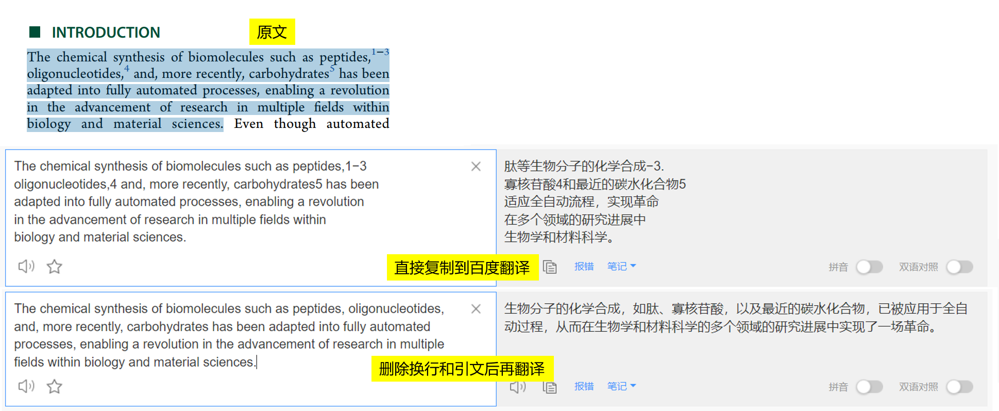
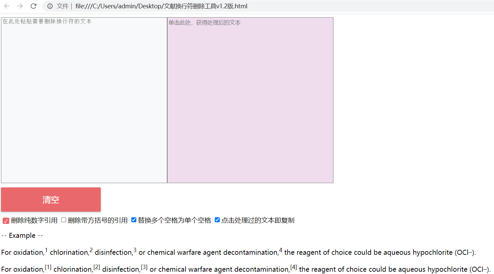
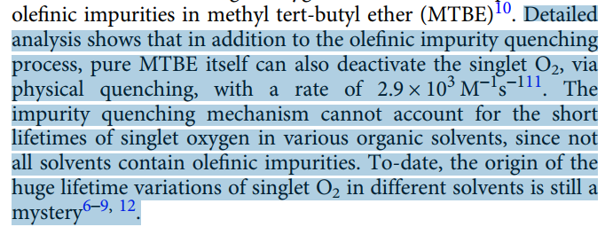
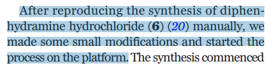
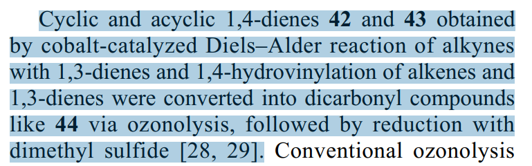
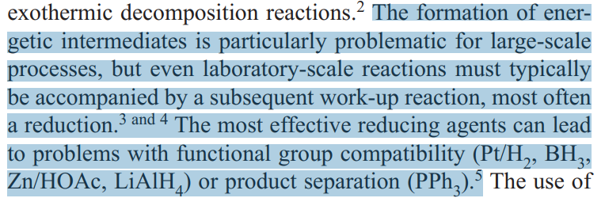
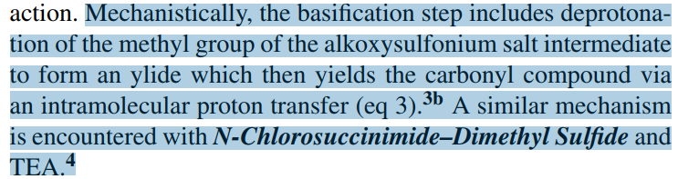

PaperClick
====
一个基于网页的文献`复制-粘贴`辅助工具，用来删除换行符、引文编号等，使得翻译、word等软件正常工作。


-----

## 背景

看英文文献的时候，有时需要把pdf里的一句或者一段话复制到有道、google翻译、百度翻译这些软件里翻译，如果复制出来的文本有制表符(Tab)、换行(\r和\n)
或者数字引文（图片原文里的`1-3`,`4`,`5`），那翻译结果往往就不正常。还有时候需要把文字复制出来到word做笔记啥的，都要手动删除这些符号，效率低，容易有遗漏。典型的例子如下：

```text
The chemical synthesis of biomolecules such as peptides,1−3
oligonucleotides,4 and, more recently, carbohydrates5 has been
adapted into fully automated processes, enabling a revolution
in the advancement of research in multiple fields within
biology and material sciences.
```



> 文献来源 https://doi.org/10.1021/acs.oprd.0c00143

## 如何使用？

下载html文件，双击打开。选中pdf里的文字，Ctrl+C复制，到网页左侧方框单击，Ctrl+V粘贴，之后单击右侧方框（会自动处理好文本并且复制），然后就可以到翻译、word等软件里Ctrl+V粘贴了。使用中不会加载任何网络资源。


## 实现原理

删换行、Tab，用正则表达式或者字符串替换都行，基本上，只要是个编程语言都能实现这个功能。比如：

+ [四行代码去除复制PDF文字段落时多余的换行符](https://blog.csdn.net/weixin_43439761/article/details/126859966)
+ [自动删除pdf复制文本中的换行符](https://blog.csdn.net/qq_37645194/article/details/113854690)
+ [一键去除pdf复制并翻译时的大量换行符](https://zhuanlan.zhihu.com/p/461853895)
+ [Python简单实现消除“PDF格式”论文中的换行符](https://dandelioncloud.cn/article/details/1443343836868345857)
+ [解决翻译论文时出现的换行问题-网页翻译-谷歌插件-翻译助手](https://www.freesion.com/article/25351147379/)

还有利用浏览器地址栏来自动替换换行符的

+ [去掉PDF内容的换行符](https://blog.csdn.net/tiao_god/article/details/124396947)

不想编程的话，word、IDE也行

+ [PDF复制文字到Word出现空格、换行符，如何批量删除？](https://zhuanlan.zhihu.com/p/536367727)
+ [PDF内复制文字多余换行问题](https://blog.csdn.net/qq_25327609/article/details/89948593)

如果是我自己用，这些都行，但是对不喜欢捣鼓的人有点难度，比如python要装开发环境和第三方库、油猴要装插件、word要记通配符。

感觉网页来的方便，跨平台、通用、可离线、不会失效，使用者下载一个html，保存好，用的时候打开就行，自带说明书。此外，还需要自动删除引文编号，于是就有了这个项目。

## Feature

+ 显示删除的换行数量
+ 显示删除的引文标记数量
+ 删除的引文标记会在原文里高亮，可以迅速比较出有没有误删或者漏删

## Todo

不同的期刊使用的引文格式不一样，而且在复制过程中丢失了字体信息、存在正文干扰等，很难准确判定引文位置，需要做很多的适配工作。一些案例如下：

1. 数字+逗号+连字符，正文有干扰



```text
 Detailed
analysis shows that in addition to the olefinic impurity quenching
process, pure MTBE itself can also deactivate the singlet O2, via
physical quenching, with a rate of 2.9 × 103 M−1s−111. The
impurity quenching mechanism cannot account for the short
lifetimes of singlet oxygen in various organic solvents, since not
all solvents contain olefinic impurities. To-date, the origin of the
huge lifetime variations of singlet O2 in different solvents is still a
mystery6–9, 12.
```

> http://www.nature.com/articles/s41467-017-01906-5

2. 括号+数字，且正文存在干扰



```text
After reproducing the synthesis of diphenhydramine hydrochloride (6) (20) manually, we
made some small modifications and started the
process on the platform. 
```

> https://science.sciencemag.org/content/363/6423/eaav2211

2. 方括号+数字



```text
Cyclic and acyclic 1,4-dienes 42 and 43 obtained
by cobalt-catalyzed Diels–Alder reaction of alkynes
with 1,3-dienes and 1,4-hydrovinylation of alkenes and
1,3-dienes were converted into dicarbonyl compounds
like 44 via ozonolysis, followed by reduction with
dimethyl sulfide [28, 29].
```

> https://doi.org/10.1134/S107042801901007X

4. 数字+and



```text
The formation of energetic intermediates is particularly problematic for large-scale
processes, but even laboratory-scale reactions must typically
be accompanied by a subsequent work-up reaction, most often
a reduction.3 and 4 The most effective reducing agents can lead
to problems with functional group compatibility (Pt/H2, BH3,
Zn/HOAc, LiAlH4) or product separation (PPh3).5 
```

> https://www.sciencedirect.com/science/article/pii/S0040402006014190

5. 数字和字母混用



```text
Mechanistically, the basification step includes deprotonation of the methyl group of the alkoxysulfonium salt intermediate
to form an ylide which then yields the carbonyl compound via
an intramolecular proton transfer (eq 3).3b A similar mechanism
is encountered with N-Chlorosuccinimide–Dimethyl Sulfide and
TEA.4
```

> https://onlinelibrary.wiley.com/doi/abs/10.1002/047084289X.rt217

## 其他参考链接

- [把文字从PDF里复制word, 怎么有效消除每行末尾的换行空格？](https://www.zhihu.com/question/41122422/answer/2408149797)
- [pdf转为word后去除多余的换行](https://wenku.baidu.com/view/cf8c054001768e9951e79b89680203d8ce2f6ae5.html)
- [Line Break Removal Tool](https://www.textfixer.com/tools/remove-line-breaks.php)
